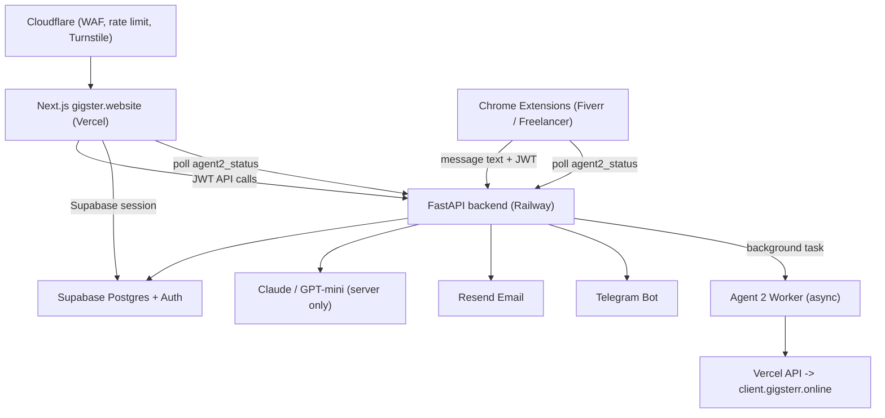
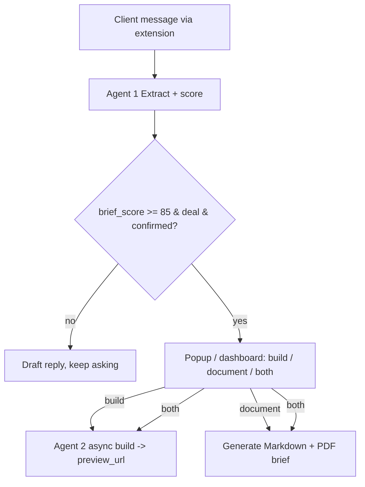

# 01 — Architecture

## Components

| Component | Where | Responsibility |
| --- | --- | --- |
| **Web** | Next.js on Vercel (`gigster.website`) | UI, auth session, thin API routes that proxy to backend. |
| **Backend** | FastAPI on Railway | Business logic, AI orchestration, prompts, payments verify, notifications. |
| **DB / Auth** | Supabase | Postgres (RLS) + Auth (email verify, JWT). |
| **AI** | Claude + GPT-mini | Server-side only. Extract / Draft / Brief / Build / Stage detect. |
| **Extensions** | Chrome MV3 (`apps/extension-fiverr`, `apps/extension-freelancer`) | Per-platform content scripts read inbox DOM; popup for login, Start/Stop, draft + Copy, brief decision; background calls backend. Upwork scaffold exists but is not active. |
| **Telegram bot** | Bot API | New-client + new-message + brief-ready + site-ready notifications; linking via `/start` + code. |
| **Email** | Resend | Verification + transactional email. |
| **Agent 2 worker** | Backend + Vercel API | Async: builds `build_spec` → deploys preview to `*.gigsterr.online`. |
| **Edge** | Cloudflare | DNS proxy, WAF, rate limit, Turnstile. |

## Data flow

## Domains

- **`gigster.website`** — the platform. Public pages + closed app behind auth.
- **`gigsterr.online`** (wildcard `*.gigsterr.online`) — Agent 2 preview sites,
  one per project slug.

## Trust boundaries

- **Browser / extension** holds the Supabase session (anon key + JWT in `chrome.storage`).
  RLS enforces per-user access. No AI prompts or persona logic reach the web bundle or
  the extension bundle (only draft text from the backend).
- **Web server (Next.js)** may use the service role key for server-rendered,
  auth-gated reads. Mutations are proxied to the backend with the user's JWT.
- **Backend (FastAPI)** owns all prompts, the service role key, third-party API
  keys (Anthropic, OpenAI, Resend, Telegram, Vercel), and payment verification.

## Web ↔ backend split

The web app is intentionally **thin**:

- Server Components read from Supabase (auth-gated) for display.
- Anything sensitive (AI, persona, payment verify, Agent 2 trigger, brief document) is a call to
  the FastAPI backend. Next.js route handlers under `app/api/` are thin proxies
  that forward the user's JWT.

See `05-security.md` for the full boundary rules.

## Extension thread memory

Per marketplace thread (`platform` + `thread_id`, e.g. Fiverr username):

1. Content script reads the full visible chat from the platform DOM/API.
2. `POST /ext/thread` upserts into `conversation_messages` (deduped by role + text + `sent_at`).
3. Backend loads the full thread from DB, runs Extract → updates `projects.project_json`.
4. **Draft path** — Agent 1 Draft returned to popup.
5. **Sync path** (`sync_only`) — save + Extract only, no new draft:
   - on **Copy draft** — includes `pending_assistant_text` (the copied reply);
   - on **reply sent** — full chat re-read from the platform (includes the message you sent).

When a **new thread** creates a project for the first time, the backend sends a
**new-client** Telegram notification (distinct from per-message alerts).

## Brief readiness → member choice

Agent 2 does **not** auto-start when `brief_score` crosses the threshold. Instead:

The member submits their choice via `POST /ext/brief/decision` (extension popup) or
the dashboard equivalent. Until then, `readiness.ready = true` is returned but
`build_spec` generation and Agent 2 are deferred.

## Async Agent 2

`run_agent2` runs as a **background task**, not inside the synchronous `/ext/thread`
response. The project row's `agent2_status` transitions `idle → building → ready`
(or `failed`). The extension popup and dashboard poll this status until the preview
URL is available.

## Active platforms

| Platform | Status | Extension |
| --- | --- | --- |
| Fiverr | available | `apps/extension-fiverr` |
| Freelancer | available | `apps/extension-freelancer` |
| Upwork | coming soon | `apps/extension-upwork` (scaffold only) |

Canonical helpers: `PLATFORM_CATALOG`, `ACTIVE_PLATFORMS`, and `isPlatformAvailable()`
in `packages/shared-types`.
