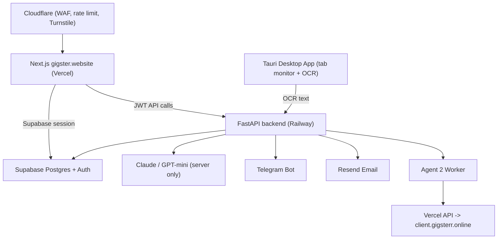

# 01 — Architecture

## Components

| Component | Where | Responsibility |
| --- | --- | --- |
| **Web** | Next.js on Vercel (`gigster.website`) | UI, auth session, thin API routes that proxy to backend. |
| **Backend** | FastAPI on Railway | Business logic, AI orchestration, prompts, payments verify, notifications. |
| **DB / Auth** | Supabase | Postgres (RLS) + Auth (email verify, JWT). |
| **AI** | Claude + GPT-mini | Server-side only. Extract / Draft / Brief / Build / Stage detect. |
| **Desktop** | Tauri (Windows) | Monitors platform tabs, OCRs new messages, sends text to backend; Auto RPA. |
| **Telegram bot** | Bot API | Notifications + linking via `/start` + code. |
| **Email** | Resend | Verification + transactional email. |
| **Agent 2 worker** | Backend + Vercel API | Builds `build_spec` → deploys preview to `*.gigsterr.online`. |
| **Edge** | Cloudflare | DNS proxy, WAF, rate limit, Turnstile. |

## Data flow

## Domains

- **`gigster.website`** — the platform. Public pages + closed app behind auth.
- **`gigsterr.online`** (wildcard `*.gigsterr.online`) — Agent 2 preview sites,
  one per project slug.

## Trust boundaries

- **Browser** holds only the Supabase session (anon key + JWT). RLS enforces
  per-user access. No AI prompts or persona logic ever reach the browser or the
  desktop bundle.
- **Web server (Next.js)** may use the service role key for server-rendered,
  auth-gated reads. Mutations are proxied to the backend with the user's JWT.
- **Backend (FastAPI)** owns all prompts, the service role key, third-party API
  keys (Anthropic, OpenAI, Resend, Telegram, Vercel), and payment verification.

## Web ↔ backend split

The web app is intentionally **thin**:

- Server Components read from Supabase (auth-gated) for display.
- Anything sensitive (AI, persona, payment verify, Agent 2 trigger) is a call to
  the FastAPI backend. Next.js route handlers under `app/api/` are thin proxies
  that forward the user's JWT.

See `05-security.md` for the full boundary rules.
